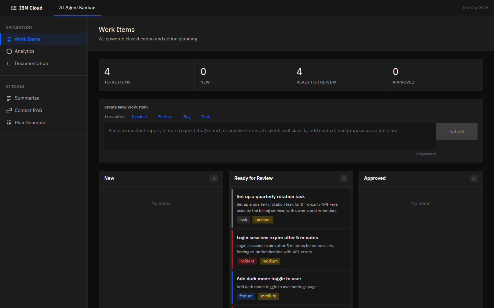
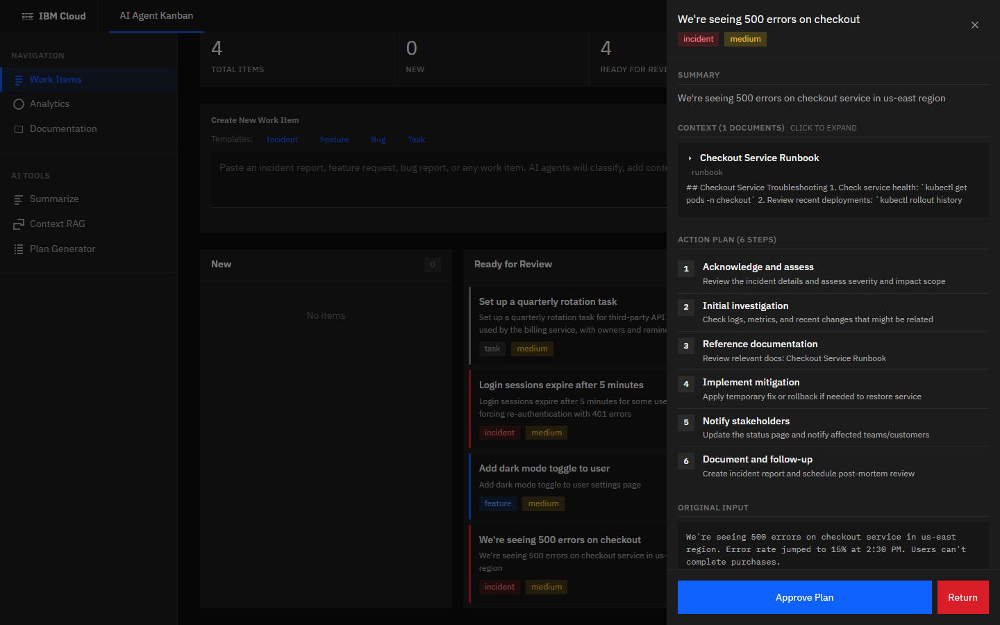

# AI Agent Kanban

A multi-agent Kanban workboard that turns unstructured work (incident reports, feature requests, bug reports) into classified, context-enriched cards with a proposed action plan, then holds each plan for human approval.

Built over one weekend for **IBM Dev Day Hackathon 2026** (Jan 30 – Feb 1).

> **Showcase only.** The working repo stays private. This copy runs end to end on mock data, with no IBM Cloud account needed. It's a local demo with no authentication: it listens on `127.0.0.1` only and should never be deployed or filled with real work items. Not accepting contributions.



## What it does

Paste a work item and three tools run in sequence:

1. **Summarize & classify:** type (`incident` / `feature` / `task`), severity, one-line summary
2. **Context retrieval:** pulls the most relevant runbooks, policies and guides from a document corpus
3. **Plan generation:** a 5–6 step action plan grounded in the retrieved context

The card lands in **Ready for Review**. A human approves the plan or sends it back. Nothing is actioned without sign-off.



## Architecture

```
 raw text ──▶ POST /api/cards ──▶ orchestrator
                                     │
                    ┌────────────────┼────────────────┐
                    ▼                ▼                ▼
               summarize.js     context.js       planner.js
             (classify, sum.)  (retrieve docs)  (action plan)
                    │                │                │
                    └──── watsonx.ai Granite ─────────┘
                          (or mock fallback)
                                     │
                                     ▼
                   card: ready for review ──▶ approve / return
```

- **Backend:** Node.js + Express, in-memory store
- **Frontend:** React 18 + Vite, IBM Carbon-inspired UI (IBM Plex Sans)
- **LLM:** IBM watsonx.ai, `granite-3-8b-instruct`
- **Integration:** OpenAPI spec for Langflow ([docs/langflow.md](docs/langflow.md))

### Graceful degradation

Every AI tool checks whether watsonx.ai is configured. If it isn't, or a call fails, the tool falls back to a deterministic mock: keyword-based classification, keyword-overlap retrieval over `backend/data/corpus.json` (10 mock runbooks and policies), and template plans. The demo never breaks on stage, and the repo runs anywhere.

## Run it

```bash
cd backend && npm install && npm start      # http://localhost:3001
cd frontend && npm install && npm run dev   # http://localhost:5173
```

Optional: to use the real LLM, copy `backend/.env.example` to `backend/.env` and add watsonx.ai credentials.

## API

| Method | Endpoint | Description |
|---|---|---|
| `POST` | `/api/cards` | Create a card and run the agent pipeline |
| `GET` | `/api/cards` | List cards |
| `GET` | `/api/cards/:id` | Card with summary, context and plan |
| `PATCH` | `/api/cards/:id/approve` | Approve the proposed plan |
| `PATCH` | `/api/cards/:id/reject` | Return for revision |
| `DELETE` | `/api/cards/:id` | Delete a card |
| `GET` | `/api/health` | Health check |

Full spec: [docs/openapi.yaml](docs/openapi.yaml). Demo scripts: [docs/demo_scenarios.md](docs/demo_scenarios.md). Pitch: [docs/pitch_deck.md](docs/pitch_deck.md).

## Built with Claude Code

Developed with [Claude Code](https://claude.com/claude-code) as a pair programmer.

---

Bryce Bolden-Scott · [bryceboldenscott.com](https://bryceboldenscott.com)
