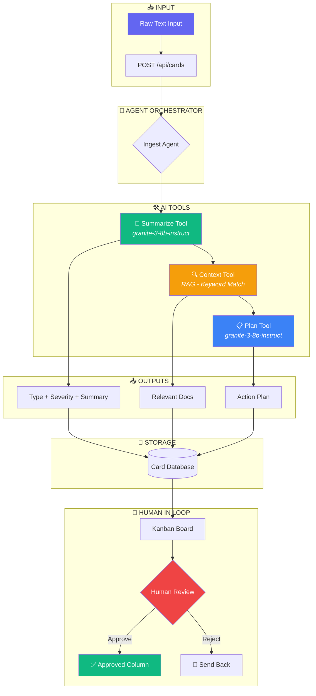

# AI Agent Kanban - Langflow Integration

## Agent Pipeline Flow

This document shows the visual flow of how AI agents process work items in the Kanban system. This flow can be implemented in [Langflow](https://langflow.org) for visual orchestration.

## Flow Diagram



## Tool Specifications

### 1. Summarize & Classify Tool
| Property | Value |
|----------|-------|
| **Endpoint** | `POST /api/tools/summarize` |
| **Model** | `ibm/granite-3-8b-instruct` |
| **Input** | Raw text (string) |
| **Output** | `{title, summary, type, severity}` |

### 2. Context Fetch Tool (RAG)
| Property | Value |
|----------|-------|
| **Endpoint** | `POST /api/tools/context` |
| **Method** | Keyword matching against corpus |
| **Input** | Summary + Type |
| **Output** | Array of context snippets |
| **Corpus** | 10 runbooks/policies (JSON) |

### 3. Plan Generator Tool
| Property | Value |
|----------|-------|
| **Endpoint** | `POST /api/tools/plan` |
| **Model** | `ibm/granite-3-8b-instruct` |
| **Input** | Summary + Context snippets + Type |
| **Output** | Array of action steps |

## Langflow Configuration

To recreate this flow in Langflow:

1. **Create Input Node** → Text Input component
2. **Add Custom API Node** → Point to Summarize endpoint
3. **Add Custom API Node** → Point to Context endpoint  
4. **Add Custom API Node** → Point to Plan endpoint
5. **Connect nodes** → Input → Summarize → Context → Plan → Output
6. **Add Output Node** → Display structured result

## IBM watsonx.ai Integration

The Summarize and Plan tools use IBM watsonx.ai with:
- **Model:** `ibm/granite-3-8b-instruct`
- **Authentication:** IAM API Key
- **Region:** US-South

```javascript
// Example watsonx.ai call
const response = await watsonxClient.generateText({
  input: prompt,
  modelId: 'ibm/granite-3-8b-instruct',
  projectId: process.env.WATSONX_PROJECT_ID,
  parameters: {
    decoding_method: 'greedy',
    max_new_tokens: 500
  }
});
```
