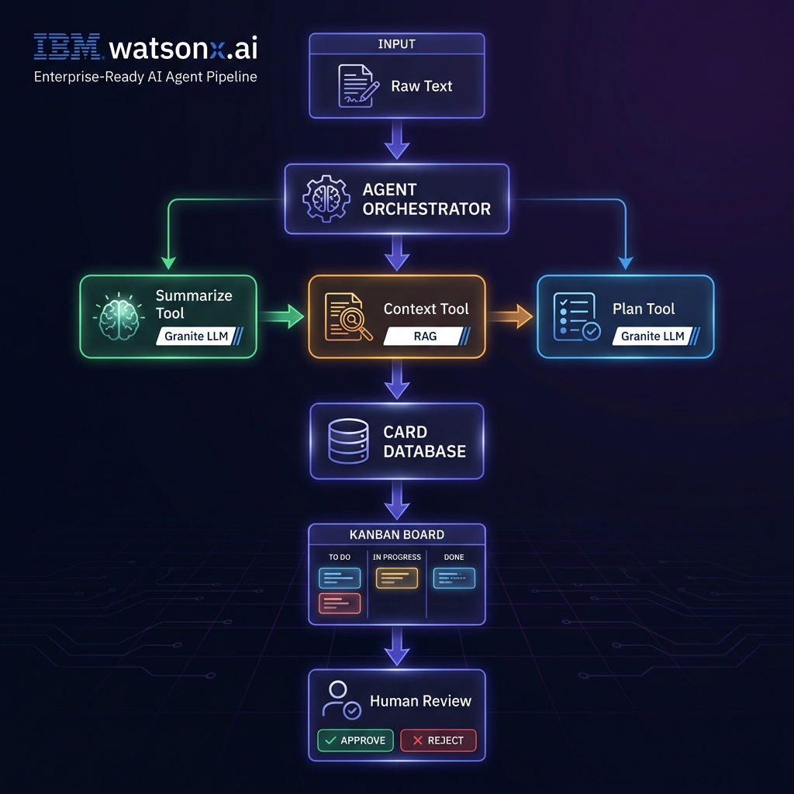

# AI Agent Kanban
## Multi-Agent Workboard for Engineering & Ops

**IBM Dev Day Hackathon 2026**

---

# The Problem

## Engineering teams drown in unstructured work

- 📧 Emails with vague requests
- 🚨 Alerts without context  
- 📝 Tickets lacking details
- ⏱️ Hours wasted on triage

**Manual classification and planning slows everything down.**

---

# Our Solution

## AI Agent Kanban

From **unstructured chaos** to **actionable plans** in one click.

```
Paste text → AI classifies → AI adds context → AI generates plan → Human approves
```

**Three AI agents work together to:**
- 🏷️ Classify work (incident/feature/task)
- 📚 Pull relevant runbooks & policies
- 📋 Generate step-by-step action plans

---

# How It Works



**Human-in-the-Loop:** Agents propose, humans approve

---

# Tech Stack

| Component | Technology |
|-----------|------------|
| **AI Models** | IBM watsonx.ai + Granite 3.0 |
| **Orchestration** | Multi-agent pipeline |
| **RAG** | Context-aware document retrieval |
| **Backend** | Node.js + Express |
| **Frontend** | React + Vite |
| **Tools** | OpenAPI + Langflow compatible |

---

# IBM Alignment

✅ **AI Developer Tools** - Per-card actions (summarize, classify, plan)

✅ **AI Automation** - Agent gateway with tool registry

✅ **AI Agents** - Multi-agent design (Ingest → Classify → Context → Plan)

✅ **Governance** - Human-in-the-loop approvals on risky moves

✅ **RAG** - Context-aware runbook retrieval

---

# Demo

## Golden Path Scenario

**Input:** "Production database is experiencing high CPU usage, queries are timing out for customers. Need immediate investigation."

**AI Output:**
- **Type:** Incident  
- **Severity:** High
- **Context:** Database runbook, monitoring policies
- **Plan:** 5-step action plan

*[Live Demo]*

---

# Future Vision

- 🔌 Real ticketing integrations (Jira, ServiceNow)
- 📊 Analytics dashboard
- 🔒 Full audit logging
- 🌐 Enterprise deployment
- 🤝 Team collaboration features

**From one team to enterprise-wide in minutes.**

---

# Thank You

## AI Agent Kanban

**Transform unstructured work into actionable plans.**

🔗 github.com/bryceboldenscott/IBMTHON

Built with ❤️ using IBM watsonx.ai
